# Section 2: Javascript Fundamentals- Part 1

## 3/15/23

- the only symbols permitted in variable names are the dollar sign and underscore
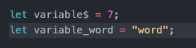

- the names established variables that never change are written as all uppercase, which VS Code recognized and styled differently than regular variables
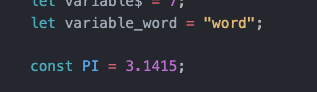

- the seven primitive js data types, the type is assigned to the value, not the variable, variables just store the value, so a variable can change to a value that has a different data type
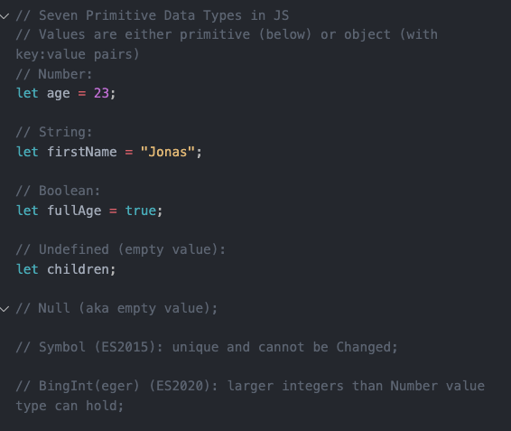

- only let variables can be undefined or empty value, not const variables, default to using const to avoid bugs with unexpected code changes, unless you're certain its value will need to change in the code
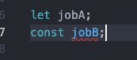

- only let variables can be undefined or empty value, not const variables, default to using const to avoid bugs with unexpected code changes, unless you're certain its value will need to change in the code
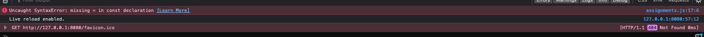

- var variables are not commonly used currently, but good to know for legacy code, similar to let, but different scope
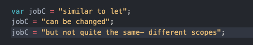

- to log more than one thing at a time, separate with a comma
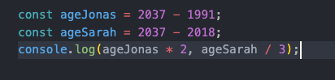

- 2 stars operator raises first number to power of second number
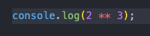

- plus or minus or times or divided by equals combines existing variable with second number and reassigns its value
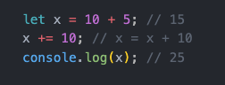

- plus plus or minus minus adds or subtracts one from the previous value of a variable and reassigns the new incremented number to the variable
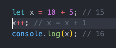

- js math operators
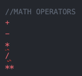

- js assignment operators
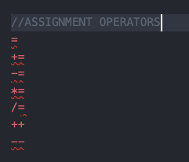

- js comparison operators
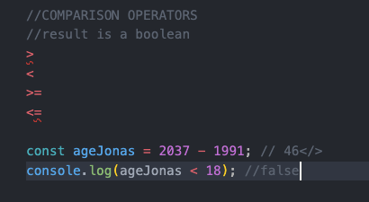

## 3/16/23

- declare more than one variable at a time by separating with a comma
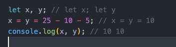

- es6 template literal is text written in backticks, with variables inside curly braces after dollar sign
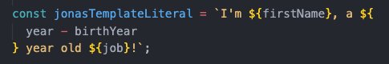

- backticks can be used for all strings, to avoid confustion with regular single or double quotes
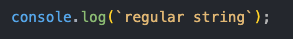

- standard way to insert a new line return in a string is with a backslash and letter n
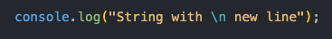
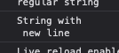

- template literals allow for new line returns in strings by just typing the return directly into the  code
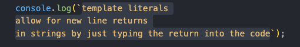
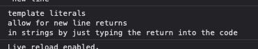

## 3/24/23

- for variable determined inside conditional code block to be accessible outside, it must first be declared outside
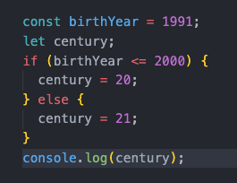

- html form input would collect a year as a text string, so convert to number with Number method, so output with method is number and without is string

- html form input would collect a year as a text string, so convert to number with Number method, so output with method is number and without is string
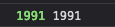

- if you try to convert a string that doesn't contain a number, the output is NaN- not a number- an invalid number
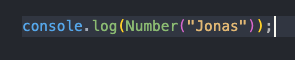

- if you try to convert a string that doesn't contain a number, the output is NaN- not a number- an invalid number
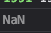

- convert a number to a string with capitalized String method
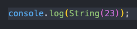

- type conversion methods
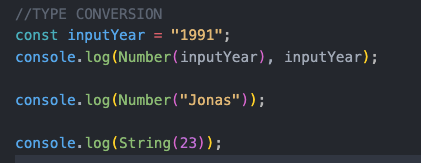

- type coercion happens when the js makes the type conversion automatically, ex a number converted to a string
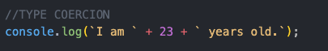

- type coercion happens when the js makes the type conversion automatically, ex a number converted to a string
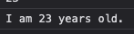

- js type coercion can also happen with the automatic conversion of a string to a number with the minus sign, which assumes math, also true for other math operators except plus
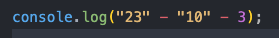

- js type coercion can also happen with the automatic conversion of a string to a number with the minus sign, which assumes math, also true for other math operators except plus
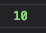

- however with a plus sign, js coercion assumes a concatenated string and converts the number to part of the string 1
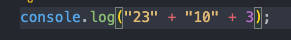
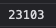

- with plus sign, number strings are concatenated, but then coerced to numbers with minus sign
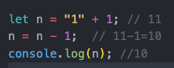

- 2+3+4 are numbers, but the y are concatenated to the string number following the plus sign
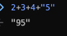

- with minus sign, string numbers are converted to numbers and added, but then the string number following the plus sign is concatenated to end
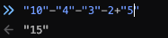

- there are only 5 falsey values, in addition to the word false, everything else is truthy
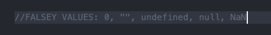

- only empty strings are falsey, any other string is truthy, empty objects are also truthy
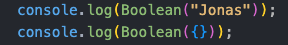

- usually js boolean coercions are automatic and implicit, for example with a conditional statement
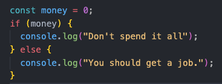

- with double equal comparison operator, js is looking for loose equality and will perform type coercion to compare, with triple equal, it is strict and will not perform type coercion

- when setting up a switch statement, each case must be followed by a break, and the last case, the default functions like the else statement, combine more than one case by listing them consecutively
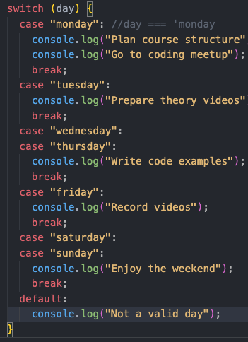

### 5/29/24
- Expressions produce a value (ex: 3 + 4). Statements do not (ex: if, else comparison).
