# Section 3: Javascript Fundamentals- Part 2

## 3/31/23

- expressions produce a value, while statement declarations do not, statements are usually larger pieces of code that get executed
- statement declaration is like a complete sentence, and expressions are like the words
- expressions produce values, statements produce actions

- only expressions, not statements, can be inserted into template literals

### Ternary Operator

- first part is condition followed by question mark then result if condition is met

- followed by colon then else statment- if condition is not met

-  the ternary operator lets you make a comparison inside the variable, so instead of using an if else statement, it can be used as an expression, without predefining the variable first

### 5/29/24- added this later - ECMAScript refers to the standard, while Javascript refers to the language in practice.

### 5/29/24: compatibility of older js versions:
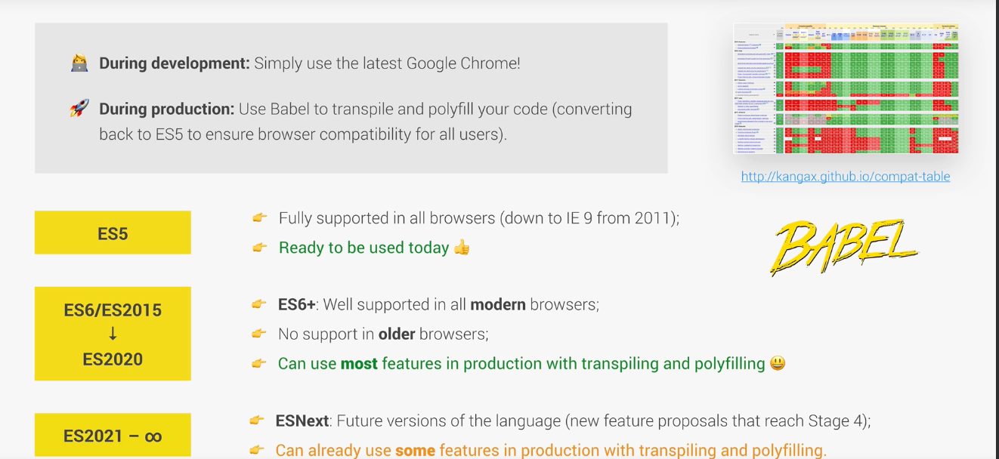

- to set js to strict mode, use strict must be the first line of code in the file, only comments can come before because they'll be ignored, strict mode makes it easier to avoid accidental errors and find errors in code

- the process of using a function is colled invoking, calling, or running the function

- in a js function, the parameter is the placeholder in parenthesis in the function definition, and the argument is the value assigned to it when the function is called

- an anonymous function can be stored in a variable and used like an expression, while a regular, named function is a declaration and cannot

- function declarations can be called before they are defined in the code (5/29/24: because of hoisting), but function expressions cannot (5/29/24: Jonas prefers this method because it forces cleaner code with all functions first before they are called)

- an arrow function works like a function expression, but with even less code to write, can be stored in variable, with parameter in parenthesis and the return after the arrow, arrow functions also have no "this" keyword

- in a more complex, multi-line arrow function, that requires curly braces after the arrow, the word return must be added to return statement

- it's common practice to return neg 1 or 9999 as the else option when a condition is not met when the inputs are numbers

- code written after a return statement, like the console log here, will be ignored because the return statement exits the function

- define an array with either square brackets or the new keyword before the capitalized version of it as a function with contents in function parameters

- pull the last element of an array by subtracting one from the length inside the square brackets for its index

- can change contents of array treating each element like a variable with square bracket and index

- push or unshift a new element to an array automatically returns the new length of that array

- pop removal method returns the element that was removed, not the length like push or unshift 

- shift removes first element of array and returns that element (not the length)

- calling the indexOf method on an element not included in an array returns neg 1

## 4/3/23

- js object ex, w key - aka property- and value pairs, like an array, but with can identify the items contained without just referencing index number, this version of object is called object-literal syntax bc all clearly defined
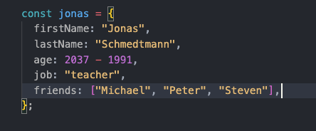

- pull data from an array using either dot followed by key property or square brackets with key property in quotes
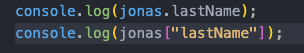

- with the bracket method of obtaining values, you can also construct an expression, ex with concatenation or template literal rather than just explicitly writing the key property string as in the dot method
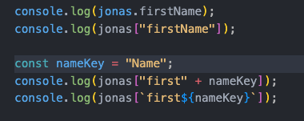

- the brackets can also be used to access info that isn't yet determined, while the dot would look for a literal property of the same name in the object, rather than the variable equivalent

- both dot and square brackets can be used to add key value pairs to an object
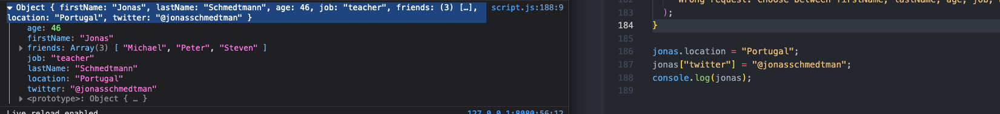

- expression function can be stored as key value pair inside an object, with function name as key property and function body as value
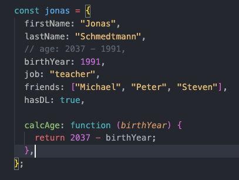

- insert arguments to functions within objects by placing the parenthesis outside of the square brackets with the key property function name
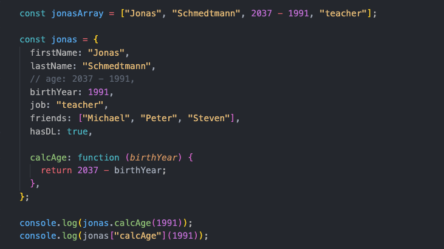

- the this variable equals the object that calls the method, in this case the jonas object calls the method from the console log, so the this keyword refers to the jonas object
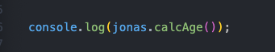

- the this keyword variable allows you to access an object from a function inside that object, the this keyword refers to the object calling the method
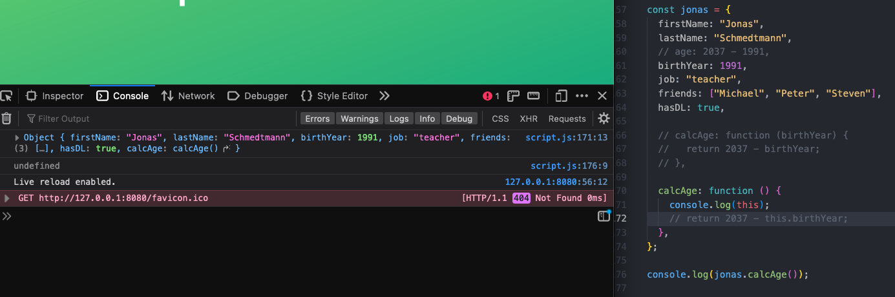

- for arguments that are already part of the object, do not repeat, instead include it in the return using the this keyword variable
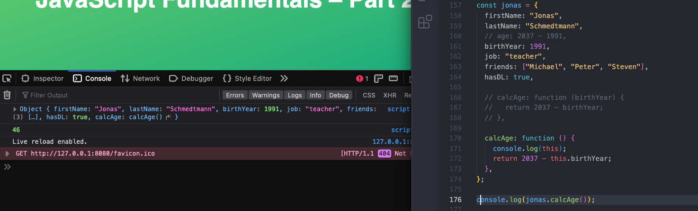

- you could replace the this keyword with the actual name of the object, and it would work, but that violates the DRY method, which could break the code in the future
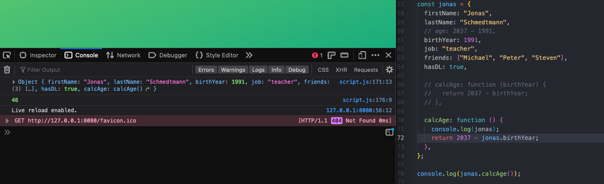

- in the case where the result of the function in an object might need to be used more than once in the code, it helps to then store it in a new key value pair in the function, here that is age property
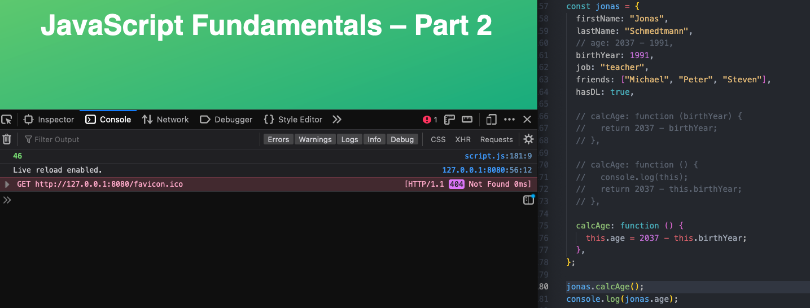

- first part of for loop requires a variable declared with let because it will be updated, this variable is the initial value of the counter in the loop
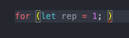

- second part of for loop setup is the value below which the let variable must stay in order for the loop to run, as soon as the condition is false, the loop stops, it is evaluated before each iteration of the loop
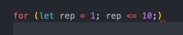

- the third part of for loop set up is changing the value of the count, remember plus plus redefines a variable by adding one to it's current value
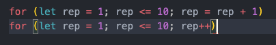

- for loop lets you use the counter variable established in set up as part of code also
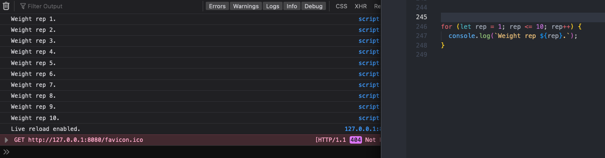

- this is a common setup pattern when looping through an array, start with the zero index, stop while still less than length, and increment by one for index increase
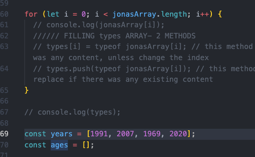

- continue in a for loop only runs the code on certain conditions, without fully exiting the loop until it is finished running, allows for skipping of steps in the loop
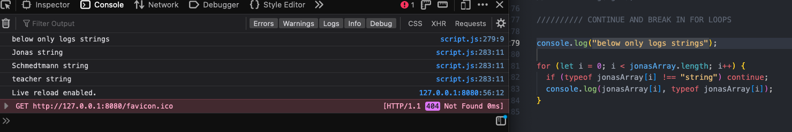

- break will exit the loop as soon as condition is met, without continuing through rest of looping
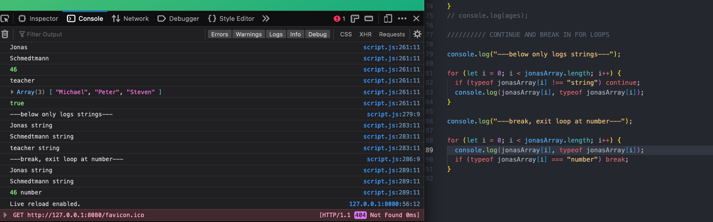

- cycle backwards through an array from end to beginning with decrementing and changing the start and while running rules
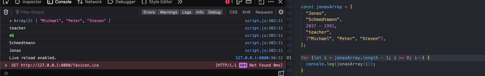

- put a loop inside a loop and use both iteration  variables
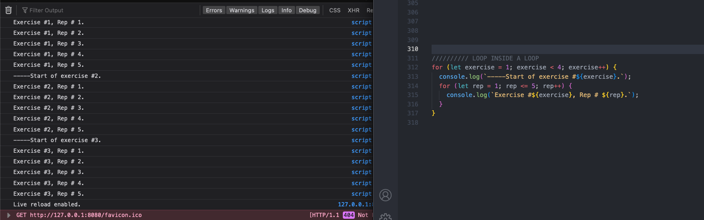

- while loops only take a condition- the loop will continue until the condition is false
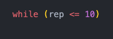

- while loop start is defined before loop definition, and incrementation inside the loop, while loops are more versatile than for loops
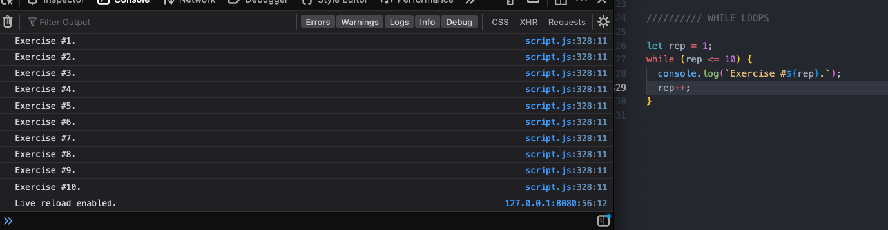

- a while loop is best for a scenario like this, when there is no way to know how many times it will need to run to meet a condition, a for loop is best whenit is known how many times it'll run and can use a counter, ex in an array
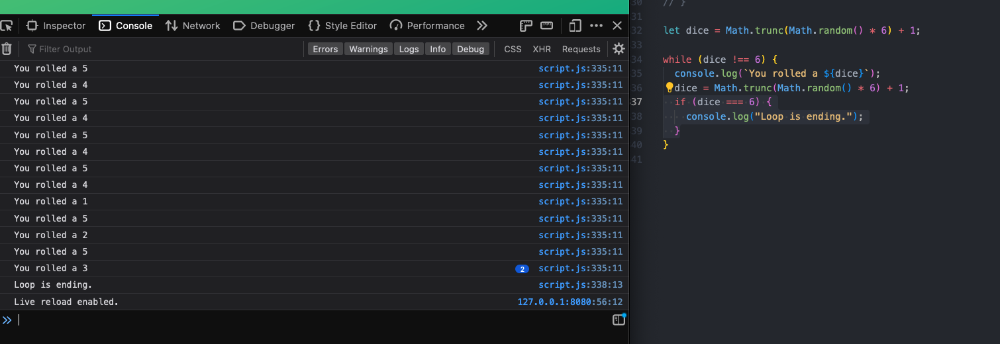
