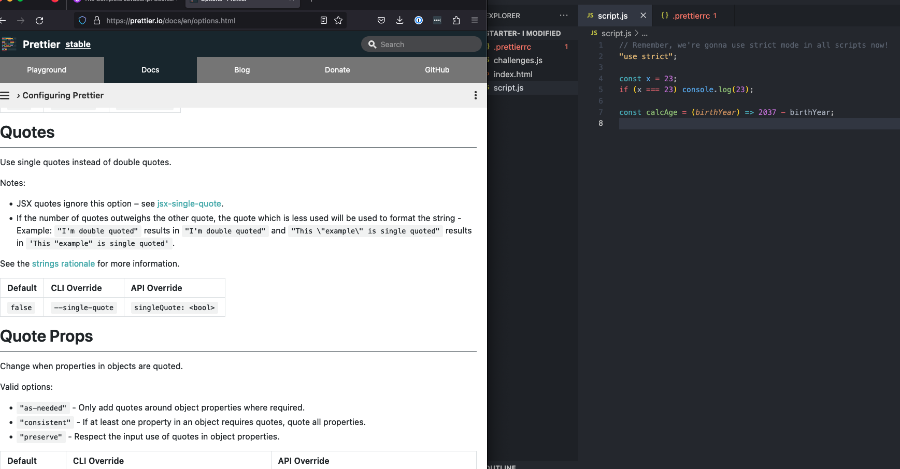
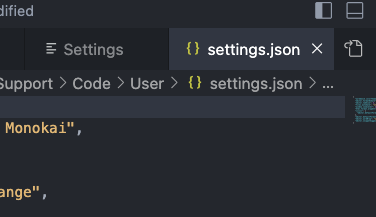
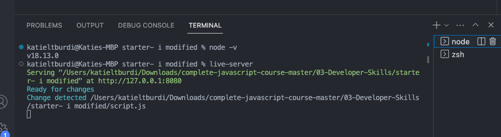
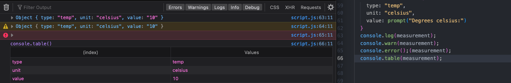
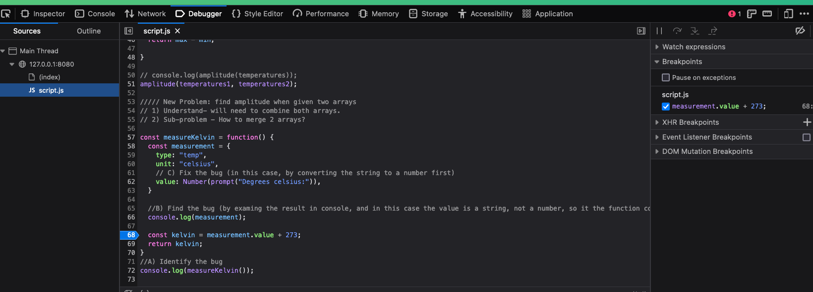
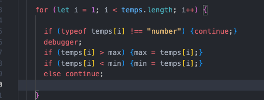

# Developer Skills & Editor Setup

## 4/4/23

2023-04-04 1 configure prettier formatting preferences for a project in a prettierrc file, view different settings options in the prettier documentation

2023-04-04 2 when in vs code settings, open the settings json from the little document with arrow icon on top right to edit the settings in json

2023-04-04 3 access terminal inside vscode from top screen menu bar or with shortcut control shift backtick, tilde, choose different terminal windows on right

2023-04-04 4 in addition to console log, you can also console warn, console error, and console table

2023-04-04 5 in chrome or firefox dev tools, access the debugger and select the script file to debug, then add breakpoints by clicking to the left of the line where you want the breakpoint, ex 68 here

2023-04-04 6 debugger can also be called directly from code

