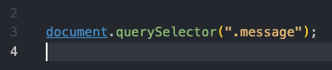
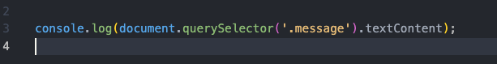
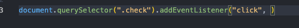
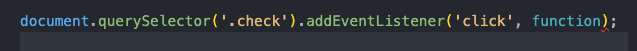
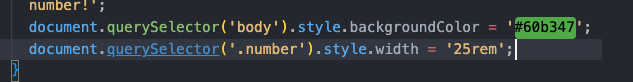
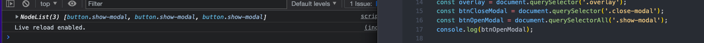
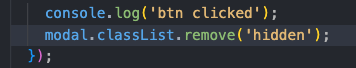
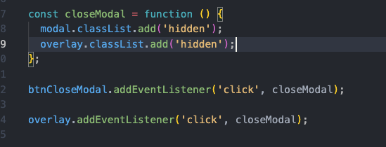

# Javascript in the Browser: DOM and Events Fundamentals

## 04/05/23

- to select an element with class of message, use the query selector from inside the document, the argument passed in parenthesis is the item searched for in quotes

- with multiple dot operators, they are executed from left to right, so to access a property of item in the query selector, in this case textContent, follow the query selector with the property name after a dot

- first input to addEventListener method is the type of event, in this case a click

- second argument passed to addEventListener is the function that tells the app what to do when the event occurs

- with dom manipulation, also select the body with query selector, then change styles by following with dot style and then the style property in camel case and the value as a string

## 04/06/23

2023-04-06 1a query selector only targets the first item in the document that matches the search, not all of them

2023-04-06 1b instead search for all of an item to access the node list of the items, which is similar to though not exactly like an array

2023-04-06 2 when accessing the class list of an element from js, do not put dot in front of class name because it is already known to be a class name based on the classlist method

2023-04-06 3 when an event calls a function, do not follow the function name with parenthesis in the event argument second input, or it will be called immediately upon rendering the page instead of on event

2023-04-06 4 global events, like keyboard events, add listener to entire document

