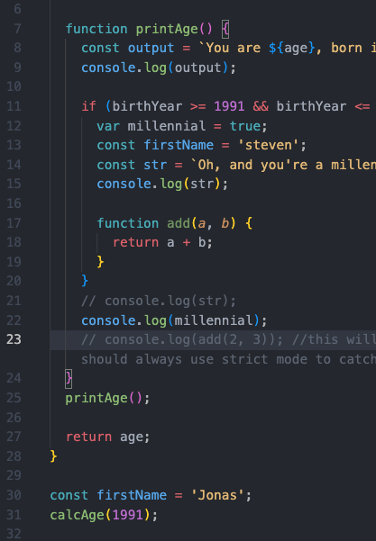
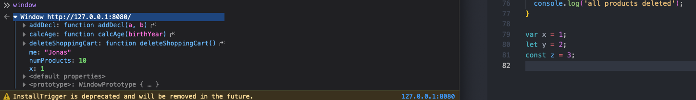
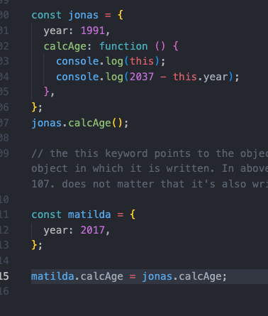
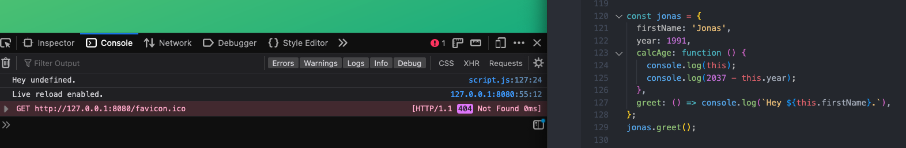
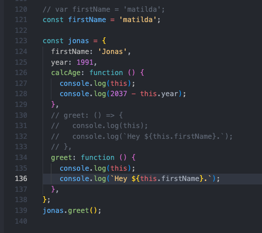
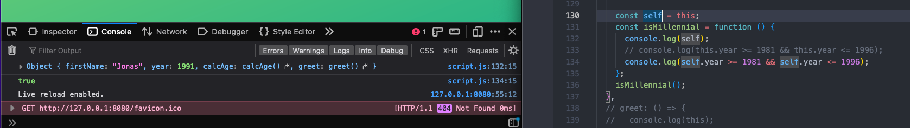
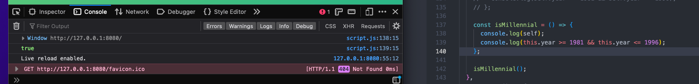
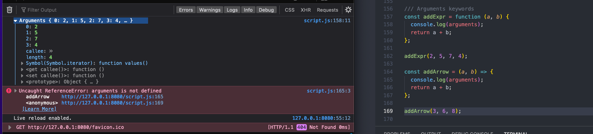
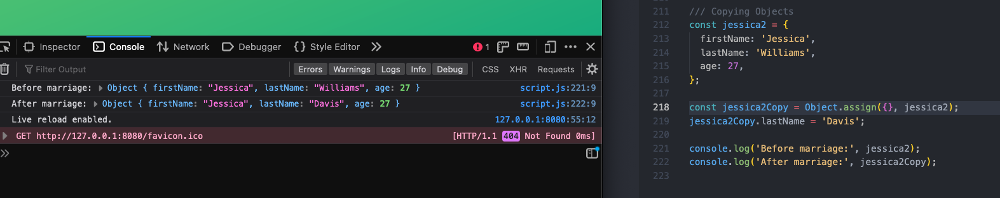
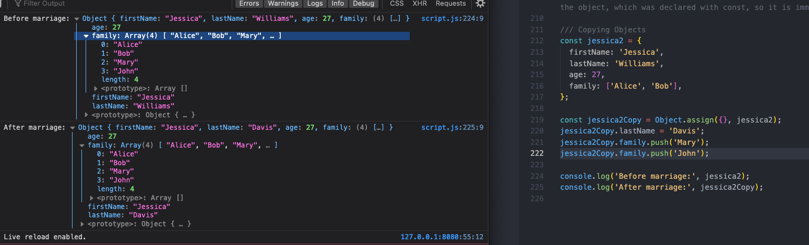

# Javascript Behind the Scenes

## 4/12/23

2023-04-12 1  because these two firstName variables have different scopes, they can both exist in the same code, just as function arguments can be the same in different functions because they are different scopes

2023-04-12 2 var variables create properties in the window object of browser, but let and const do not

2023-04-12 3 objects can borrow methods from other objects, and the this keyword will transfer with it, so that the new object calling the method is what  the this keyword references, rather than the object in which it is explicitly written

2023-04-12 4a even in the case where the this keyword is referenced by a specific caller, arrow functions do not have their own this keyword, so when attempting to access, undefined is returned

2023-04-12 4b even in the case where the this keyword is referenced by a specific caller, arrow functions do not have their own this keyword, so when attempting to access, undefined is returned

2023-04-12 5a pre es6 workaround for this keyword inside regular function defaulting to undefined is to set a variable to self outside that function and then call it in the function to represent the this keyword

2023-04-12 5b post es6 workaround to allow function inside function to access parent function's this keyword is to make second function an arrow function which doesn't have its own this, but steps back to the previous function that does- inheritance

2023-04-12 6 the arguments keyword allows access as an array like object to items passed into function, even when there are more than specified in parameters, but only for reg functions, not arrow

2023-04-12 7a copy an object, instead of just adding another variable that references the same object, with the Object assign method

2023-04-12 7b object assign method only works on first level of object, not nested objects, arrays, etc, which still point to original, so that modifying nested copy also modifies original

