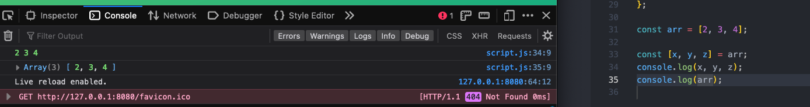

# Data Structures, Modern Operators, and Strings

## Destructuring Arrays and Objects

### 4/13/23
2023-04-13 1 destructure an array buy setting the variables you'd like to assign to each item in array equal to the array itself, note original array is still intact and accessible as well

2023-04-13 2 array items are matched to variables in order, skip an item by leaving a blank between commas

2023-04-13 3a clunkier method to switch array items by first reassigning to a temporary variable to store the value while switching

2023-04-13 3b easier method to switch placement-order of array items with destructuring by just reassigning

2023-04-13 4a create a method inside an object, then call that method, and access the arrays inside the object to create a new array

2023-04-13 4b destructure the array to assign variables to the individual array elements inside the object, allows you to receive more than one variable from just one function call

2023-04-13 5a use destructing to access nested array contents

2023-04-13 5b or destructure nested array at same time as parent array with additional square brackets

