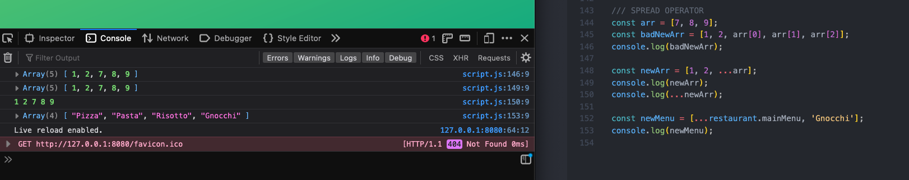
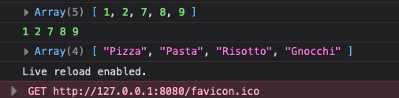
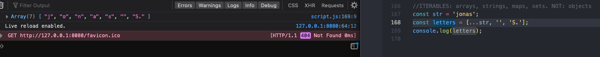
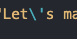
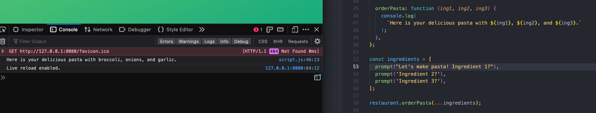
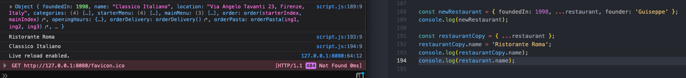

# Data Structures, Modern Operators, and Strings

## Spread and Rest

### 4/13/23

2023-04-13 11 for functions with a lot of parameters, you can pass an object into the function, and the function will destructure the object automatically

2023-04-13 14 the spread operator is similar to destructuring an array, but does not assign to variables, and can only be used in places where values would be comma-separated

2023-04-13 15 the spread operator copies the contents of one array into another, which can be helpful for joining two or more arrays

2023-04-13 16 like arrays, strings, maps, and sets are also iterables, and can take the spread operator

2023-04-13 17 use forward slash to escape the apostrope inside of string, so that js doesn't read it as the end of the string

2023-04-13 18 use spread operator to insert the contents of an array of prompt results as the arguments in an object method

2023-04-13 19 spread operator can also be used to copy objects, and then modify if needed, order of items does not matter, changing copy does not change original

