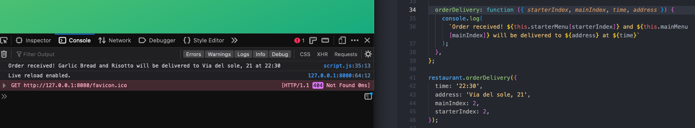
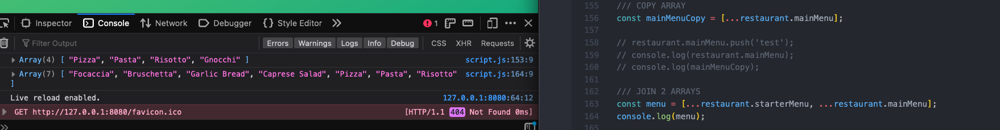
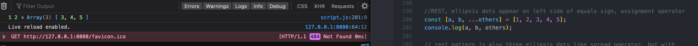
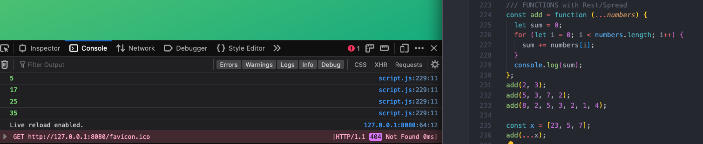
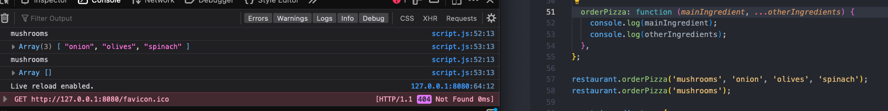
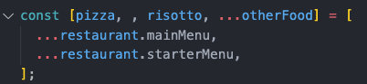

# Data Structures, Modern Operators, and Strings

## Spread and Rest

### 4/13/23

- for functions with a lot of parameters, you can pass an object into the function, and the function will destructure the object automatically

- the spread operator is similar to destructuring an array, but does not assign to variables, and can only be used in places where values would be comma-separated

- the spread operator copies the contents of one array into another, which can be helpful for joining two or more arrays

- like arrays, strings, maps, and sets are also iterables, and can take the spread operator (Objects are not iterable and cannot take spread operator. Also can't use spread operator for js input template literal becasue its not a place that expects comma separated variables.)

- use forward slash to escape the apostrope inside of string, so that js doesn't read it as the end of the string

- use spread operator to insert the contents of an array of prompt results as the arguments in an object method

- spread operator can also be used to copy objects, and then modify if needed, order of items does not matter, changing copy does not change original

- spread vs rest behavior determined by which side of assignment operator they appear, rest element must be last listed

- rest pattern is also three ellipsis dots like spread operator, but with reverse behavior- collects multiple elements and combines into array, called rest because it takes the rest of the remaining elements not explicitly selected

- assigning spread operator on right to variables declared by rest operator, rest operator collects all elements after last specifically stated, not those before or between, in this case the skipped pasta from main menu

- using rest operator in objects

- instead of specifying multiple arguments when calling a function, use rest arguments to combine them first, then call the function on the one whole argument that includes all of the individual items

- using rest to collect function arguments, when there is nothing for the rest parameter, it returns undefined

- spread operator is used where we would otherwise write values separated by a comma, rest operator is used where we would otherwise write variable names separated by a comma

