# Data Structures, Modern Operators, and Strings
## Short Circuiting and Logical Assignment

### 04/13/23
- short circuit- if first value of OR statement is truthy, the first value is immediately returned, if first (or more) value is falsey, they last is returned even if its also falsey
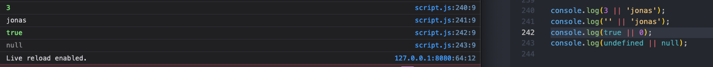

- if multiple values, the first truthy value is returned and the rest go unevaluated- last value is returned if none are truthy
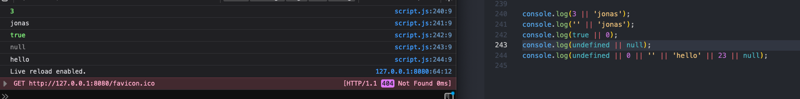

- instead of using ternary operator, can use short circuiting to define a value
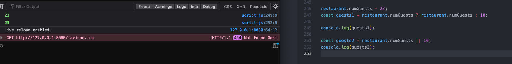

- neither method works if actual number is zero because that is also falsey, so if you're trying to check if something exists at all and return that number, 0, it will return the next truthy value instead
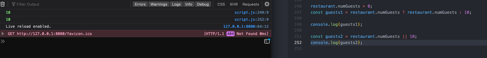

- and operator short circuits when first value is falsey, without evaluating rest of statement and returns the first falsey item or the last item, even if it's also truthy
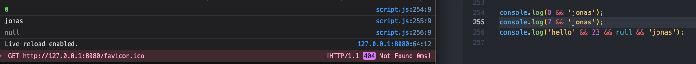

- and operator short circuiting can replace if statement by checking if a method exists, and then applying that method only if it does, and if it doens't, it won't even try to
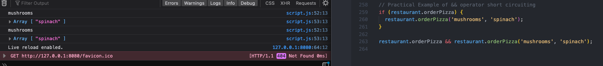

- to fix the instance where 0 returns falsey instead of the number 0, use two question marks, aka the nullish coalescing operator, which only considers null and undefined as falsey, but 0 or empty string are truthy
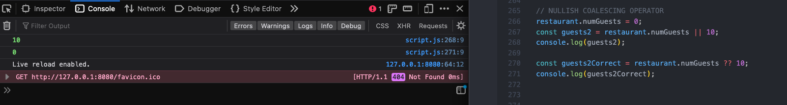

### 04/14/23

- or logical assignment operator using or equals instead of rewriting true condition
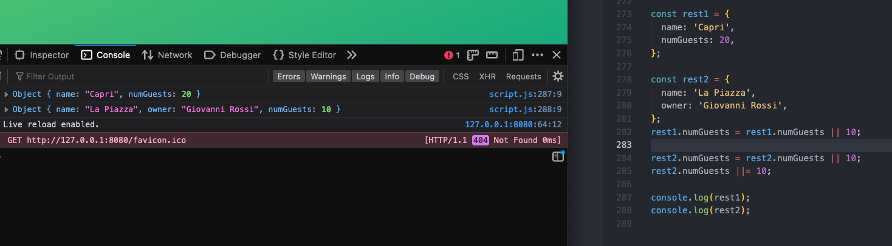

- like short circuiting, or logical assignment operator skips all falsey values, even 0, which can cause undesirable results
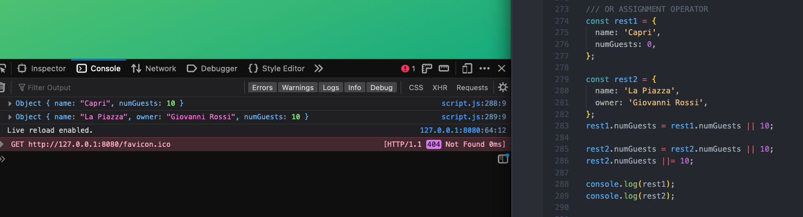

- logical nullish assignment operator overcomes the falsey zero issue
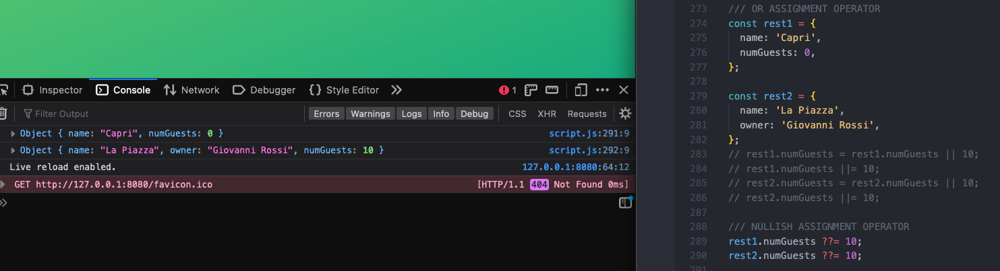

- logical or assignment operator assigns a value to a variable when it is falsey- undefined, while logical and assignment operator assigns a value when it is otherwise truthy, aka not undefined
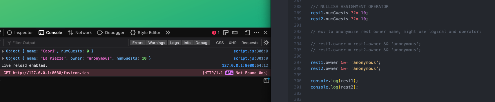
