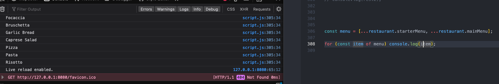
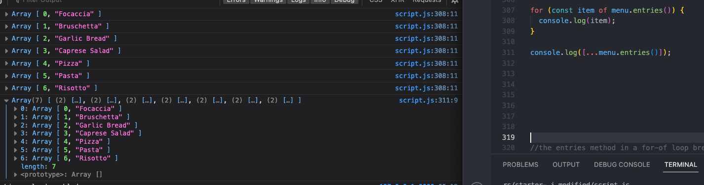
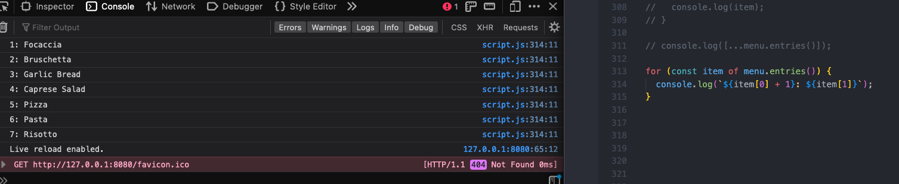
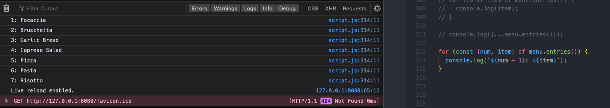
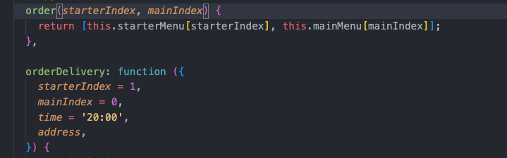
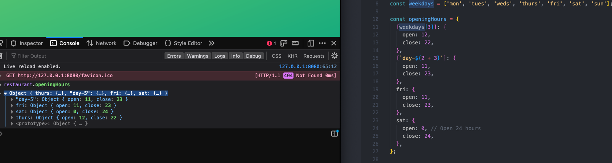
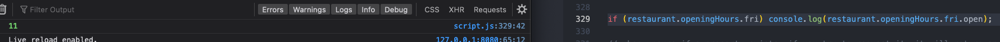
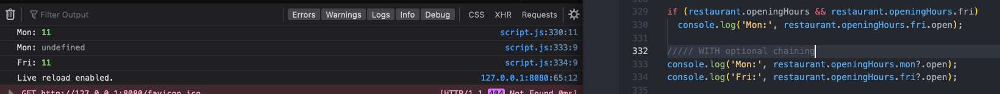
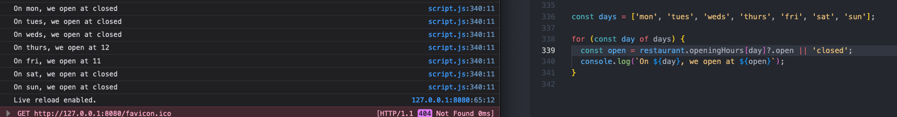
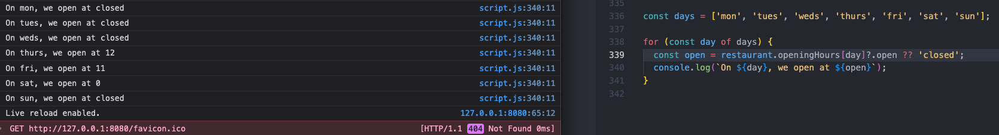

# Data Structures, Modern Operators, and Strings
## For of loops and Optional Chaining

- for-of loop breaks up each item of a group of inputs, the item variable is always the current elemnt of each iteration

- the entries method in a for-of loop breaks each item into it's own array of the item index and the item itself

- the two items of each individual array can then be used in a template literal, for example

- the individual arrays can also be destructured, so that the two elements of each array can be used separately, with their own variable names

- simpler, es6 way of writing object methods- remove the function word and the colon, see top method vs bottom in this note

- compute property names in addition to their values, ex by pulling from an array, can also use destructuring

- when unsure if a property exists, if you try to request it, it will return an error, so first check if the property exists before accessing it's value or nested properties

- optional chaining- question mark after uncertain property before a dot and the desired value, so if a property doesnt exist, then returns undef, existence means not-nullish, so 0 and empty str exist, but undef and null do not

- use optional chaining to access properties within a for of loop

- set default property if condition isn't met with or logical operator, but this returns error for sat in this ex bc should be open, but it opens at 0, a falsey value

- use nullish coalescing operator instead

