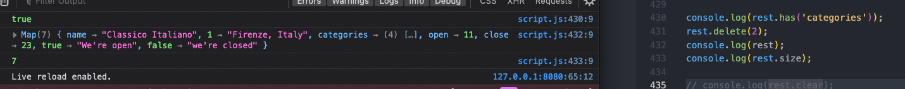
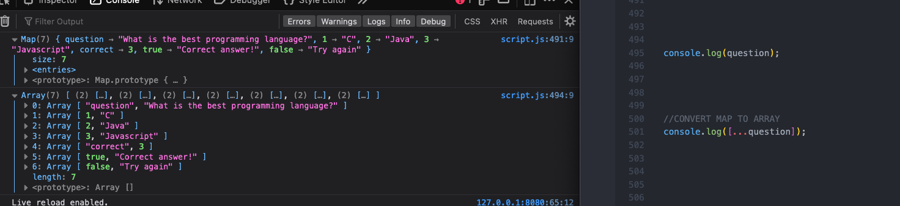
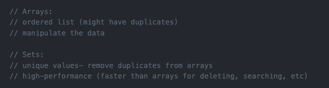

# Sets and Maps

- create a set with new Set keywords then pass it an iterable inside the parenthesis

- sets are like arrays in that they have individual items, io key-value pairs, but different bc each element is unique, even if passed duplicates and order doesn't matter

- strings are also iterable, and so can be passed into a set

- check size or info contained in a set

- add or delete method for sets allows you to change contents

- empty the set with clear

- this doesn't work- sets do not have indexes like arrays, so there is no way to get data out of a set. It's not necesary to get the data like an array because order doesn't matter and there are no duplicates, so the only thing to check is whether an item is in the set or not using the has method.

- sets are iterable and so can be looped through

- the main use for a set is to remove duplicate values from an array

- because both sets and arrays are iterable, set can be converted to array with spread operator

- 6/14/24: because strings are also iterable, you can use set methods to work with strings too (like size to find the number of unique characters in the string)

- the easiest way to create a map is to create an empty map without passing anything in

- and then pass the info with the set method listing key value pairs

- the set method automatically returns the updated map with the data that was passed in the method

- chain each key value setting for the map to the previous with period dot between

- use get method with key property passed in

- with booleans as the keys, you can access different data in the map, depending on conditions

- use has to check if a method contains a certain key and delete with delete method, and size to check how many pairs it contains

- clear method deletes the map

- the 1,2 array here is not the same object in the heap from when it was set to when it was called

- for js to understand which array you're referencing, store it in a variable first

- with this technique- storing info in variable first, objects can be used as map keys

- instead of using cumbersome set method to populate a map, especially for maps with more data, use an array containing multiple arrays

- the array of arrays returned in a map is the same structure as calling object entries- this means objects can easily be converted into maps

- convert an object to a map by passing the object into a new map variable

- maps are iterable with loops

- convert a map to a array with the spread operator

- data sources and storage in js

- arrays vs sets

- objects vs maps

