# Strings

- parameters input in slice method for string are beginning and ending indexes- the first character included in the slice to but not including the last, if no last, through end of string
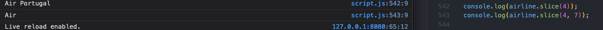 

- the substring is a new string - does not change the original, it is impossible to mutate a string, as they are primitive data types, to use, put in new variable
 

- in some ways, strings can be accessed and manipulated like arrays
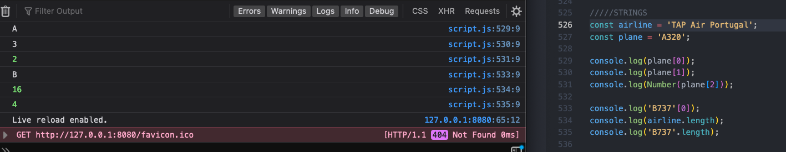 

- strings can take methods like arrays, ex for indexes
 

- index method is case sensitive, so if an item is not found, its index is -1
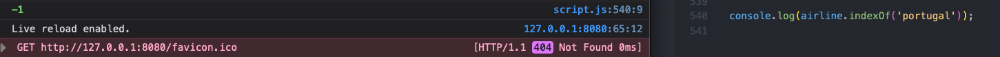 

- indexOf methods are useful when you don't know exactly the content of the string, or how long the words are, etc- to get first word start at 0 index through first space as string
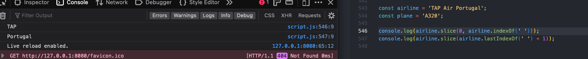 

- negative index on a slice pulls from end of string
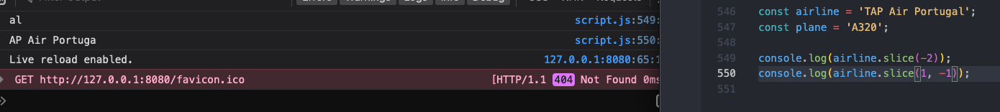 

- using slice in a function
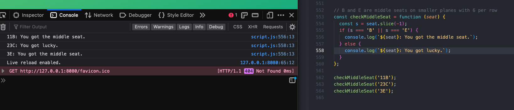 

- even though strings are primitives, they have methods because js treats them like objects with boxing- behind the scenes js converts the string primitive to a string object- puts it in a box
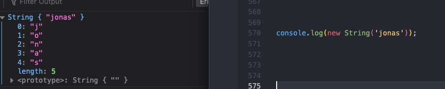 

- even methods called on string objects will return a string primitive because after the method, which converted from string to object, will always convert back to string before return
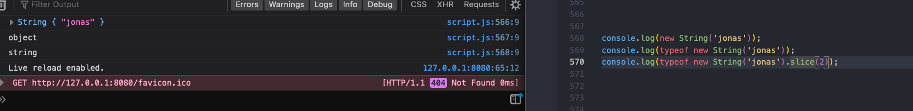 

- chain together string methods to use more than one at a time
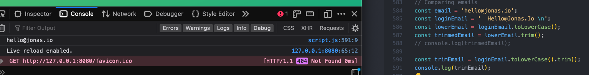 

- use replace method to replace parts of strings, will only replace first occurrence, but can chain together
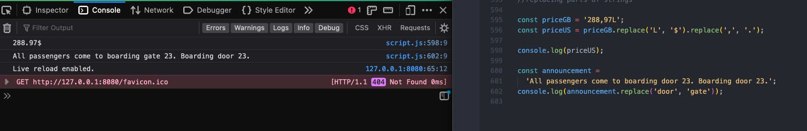 

- use replace method to replace parts of strings, will only replace first occurrence, can chain together or replaceAll or use a global regular expression
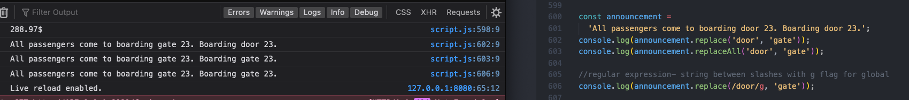 

- includes, startsWith, endsWith return booleans for strings
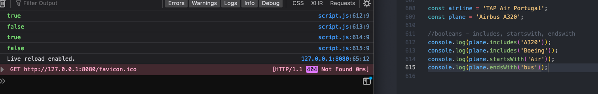 

- split method allows to break a string into multiple parts based on a divider string, then put the parts into an array
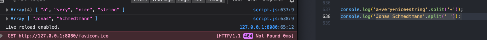 

- join method is opposite of split- merges array items into a string
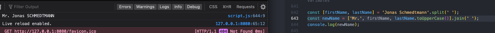 

- Padding a string - adding characters to a string to reach a certain length, 1st input is total string length, 2nd input is what the padding is
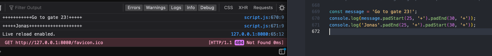 

- trick to convert a number to a string is to concatenate an empty string to the number
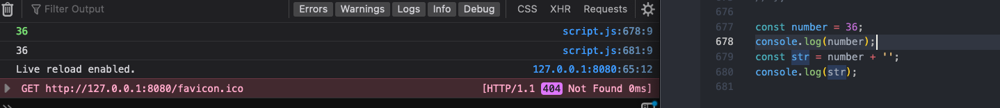 

- Repeat method allows to repeat same string multiple times
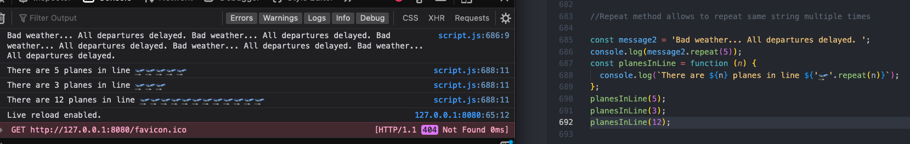 
