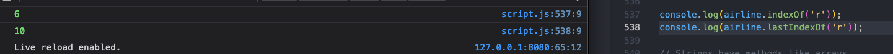

# Strings

- parameters input in slice method for string are beginning and ending indexes- the first character included in the slice to but not including the last, if no last, through end of string
 

2023-04-27  3b the substring is a new string - does not change the original, it is impossible to mutate a string, as they are primitive data types, to use, put in new variable
 

2023-04-27 1 in some ways, strings can be accessed and manipulated like arrays
 

2023-04-27 2a strings can take methods like arrays, ex for indexes
 

2023-04-27 2b index method is case sensitive, so if an item is not found, its index is -1
 

2023-04-27 4 indexOf methods are useful when you don't know exactly the content of the string, or how long the words are, etc- to get first word start at 0 index through first space as string
 

2023-04-27 5 negative index on a slice pulls from end of string
 

2023-04-27 6 using slice in a function
 

2023-04-27 7a even though strings are primitives, they have methods because js treats them like objects with boxing- behind the scenes js converts the string primitive to a string object- puts it in a box
 

2023-04-27 7b even methods called on string objects will return a string primitive because after the method, which converted from string to object, will always convert back to string before return
 

2023-04-27 8 chain together string methods to use more than one at a time
 

2023-04-27 9 use replace method to replace parts of strings, will only replace first occurrence, but can chain together
 

