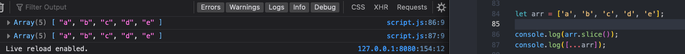
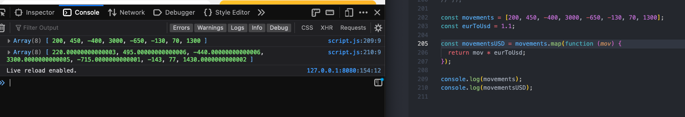
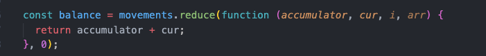
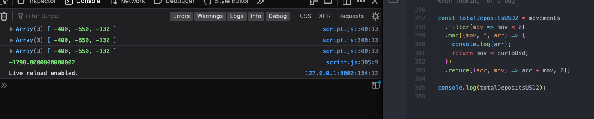
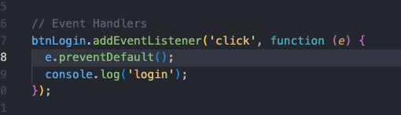

# Arrays

## 5/11/23

#### Slice Method
- call the slice method on an array without any indexes to create a shallow copy, like using the spread operator

#### Splice Method
- splice method works like slice, but it DOES change the original array by removing whatever is spliced out, while slice does not change the original

#### Reverse Method
- reverse method mutates original array when reversing

#### Concat Method
- concat method works like spread operator to combine more than one array and also does not mutate the originals

#### At Method
- the at method works like retrieving an array item or string character by its index

- the at method is useful instead of brackets for getting last item in an array of unknown length

#### For Each Loops
- you cannot break out of a for each loop- continue and break statements do not work, instead, for each always loops through entire array, so if that is the desired behavior, use a for of loop instead

- for each method is similar to for of loop method, but simpler, for each is a higher order function with a callback function inside

- to deconstruct, like in for of loop in a for each loop, first parameter is current element, second is the current index, third is the entire array being looped

- in maps for each loops, first parameter is the current value, second is the key, and third is the entire map that is being looped over

- in a set, the key and value parameters are the same because a set doesn't have keys, but the parameter still exists to follow the same pattern as for each loops for other iterables

- replace the "key" variable with an underscore, a throwaway variable

- insertAdjacentHTML takes 2 string inputs- first the position at which to attach the html, second is the string of the html to be inserted

## 5/12/23

#### Map Method
- map method is like for each loop, but takes a function as an input that creates a new array based on the original array, usually with some operation applied to each original array element
- 

#### Filter Method
- filter method searches the original array for elements that satisfy a particular condition and puts them into a new array

#### Reduce Method
- reduce method combines all values of original array into one single value, ex by adding all numbers together, or another operation, no new array, only the reduced value

- like for each, map method has access to same 3 parameters- current element, current index, and entire array

- using a method instead of a loop (ex a filter method instead of a for of loop with if statements inside) allows for chaining of methods, so you can condense the code more easily

- unlike other methods that take the current element, the current index, and the entire array as their parameters, the reduce method takes the accumulator as its first parameter before the other three parameters

- pass the initial value of the accumulator into the reduce input, after the function
- 

## 5/22/23

#### Chaining Methods
- Methods can be chained together as long as the method returns a new array (ex: filter, map methods) for the next method in the chain to use. 
- No other method can follow reduce method because its output is not a new array/
- The problem with chaining methods is that it is difficult to tell which step produces a bug when it doesn't work as expected.

- use the array parameter that comes with the method to log the entire array when looking for a bug
- the logged array will be the current step's array, meaning the array that was the output of the previous step's method

- Be careful not to overuse chaining. For really large arrays, to continually produce and cycle through new arrays in the chain can create performance issues. For large arrays, try to compress into as few methods as possible.
- Bad practice in js to chain methods that mutate the original array (ex: splice, reverse).

## 5/26/23

#### Find Method
- use find method to retrieve one element of an array based on a condition
- find method accepts a condition and callback function as inputs, then loops over array with the inputs
- find method only returns the first element in the array that meets the condition, not a new array

- prevent default method on an event will prevent its default behavior, in this case a submit button would normally reload the page, so prevent it

- a user hitting enter while the focus is in either the user or pin text input boxes will also trigger the click event
