# Numbers, Dates, Intl, and Timers

## 6/26/23

- because js (and some other languages, ex php, ruby) operates in binary, base 2, some fractions are difficult to represent and can lead to unexpected math results
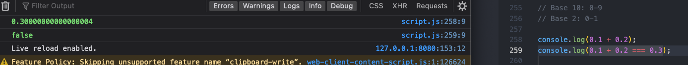

- convert strings to numbers with number object constructor or just by putting plus sign in front
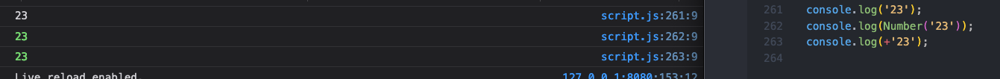

#### Number.parseInt
- parseInt will pull a number out of a string, even with spaces, as long as the string starts with the number
- parseInt takes a second parameter, the radix, which is the base of the numeral system (usually 10)
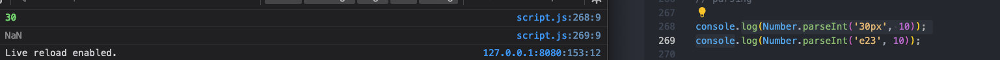

#### Number.parseFloat
- parseInt only pulls out the integer part of a number, while parseFloat pulls the whole number, including decimal
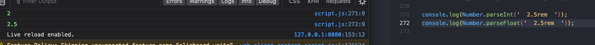

- parseInt and parseFloat are global functions, meaning that they will both work without the Number object constructor specified, but it is better practice to use the number object, which provides a "namespace"

#### Number.isNaN
- isNaN works with number constructor to identify what is and is not a number (NaN)
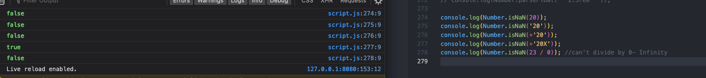

#### Number.isFinite
- use isFinite can sometimes be better to check if something is or is not a number (instead of a string) because of the idiosyncrasies of isNaN (ex, Infinity
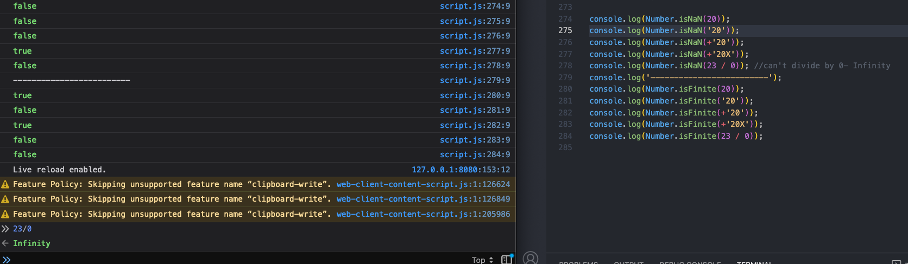

#### Number.isInteger
- isInteger checks if input is an integer number

#### Roots of Numbers
- use sqrt Math method (square root only) or exponentiation to a fractional root to get square, cube, etc roots

#### maximum/ minimum
- Math.max and Math.min will automatically perform type coercion, so that if some of the number inputs are written as strings, they will be automatically converted to numbers for the max/mincalculation
- Math.max/min does not parse numbers from strings that include other characters though
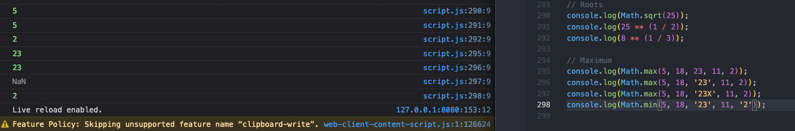

#### Rounding
- Math.trunc simply removes any numbers after decimal point
- Math.round will actually round up or down
- Math.ceil (ceiling) will automatically round up
- Math.floor will automatically round down
- all of these math rounding methods will also automatically do type coercion on string inputs
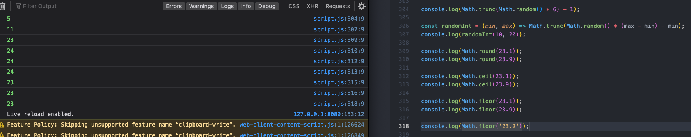
- with negatives, trunc still just removes after decimal, but rounding is more negative for floor, and less negative for ceiling
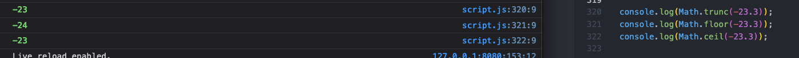
- toFixed allows you to specify number of decimal places, but returns a string, not a number, so convert to number with number constructor or plus sign
- toFixed converts to a string because it is a primitive and (similar to string methods), and primitives can't have methods, so first it is converted to string via boxing, before performing the operation
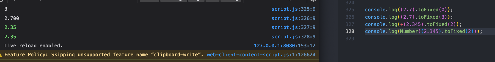

#### Remainder (modulo)
- percentage sign is symbol for remainder operator, returns the remainder only of the division of two numbers
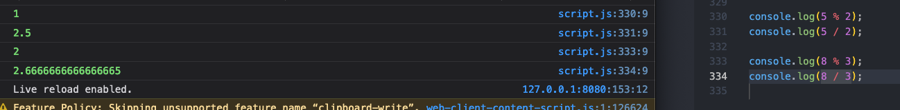

#### Numeric Separators
- Numeric separators- underscores(_) (like comma in math) separate numbers, to make the code easier to read, but they are not logged in the console
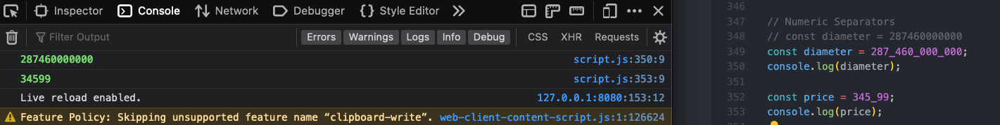
- be mindful that because the underscore is not really part of the number and only for ease of reading that regardless of where it is placed, it will really be the same number, even though in one case you might use it like a comma to indicate thousands, and in another like a period to indicate cents
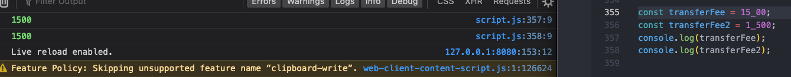
- numeric separator can only be placed between numbers (ex: not number and decimal, not two in a row, not at beginning, not at end of number)
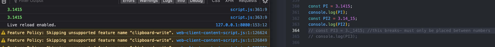
-number separate also doesn't work when converting with number object operator
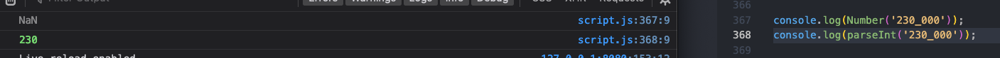
