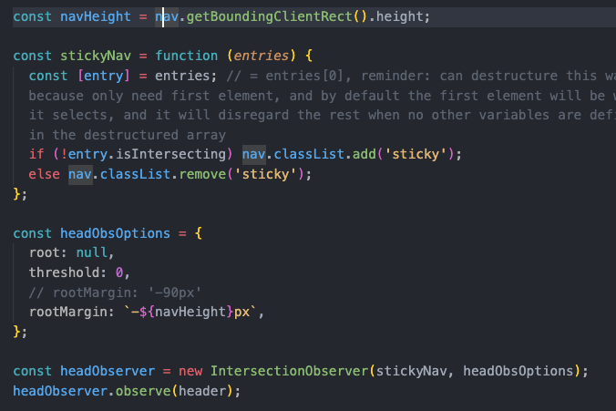

# Advanced DOM and Events

### 6/30/23

#### DOM API Organization Breakdown

- To select the entire html document of a webpages, select the documentElement. (Just document alone is not a real dom element, so it is not enough to select.)
- for documentElement, head, and body, no additional selector is needed

#### Creating and Inserting Elements
- prepend will add the new element as the first child of the parent element you're adding to
- append will add as last child of the specified parent element
- prepend and append can also be used to move elements to first or last child positions (not just insert them)
- this means that you can't have duplicates of an element by both prepending and appending it
- as a workaround, to insert it more than once, clone the element and its children with cloneNode

- before and after insert the new element as a sibling of the specified element

### 7/5/23

- using the style method to apply new styles to an element in js automatically creates inline styles in the html (rather than a separate style in the css file)
- to log style info to the console, the style must be applied as in-line (can't pull from stylesheet)
- Use "getComputedStyle" to pull the style from the stylesheet. The computed style refers to the actual style, as it appears on the page.

- getComputedStyle returns a string, so use Number.parseFloat to convert back to a number when manipulating the style.

- the documentElement (described above) accesses the root element, so to change a CSS variable's property, first access the root, where CSS variables are stored
- the two inputs to the setProperty method are 1- which property to set, and 2- what to set it to (it's new value)

- access standard properties for a given element by chainging their names to the element in js
- to access class, use "className" (historical reasons) instead of just class
- to read non-standard attributes from the dom, which would otherwise return undefined using the same method used for standard attributes, instead use "getAttribute"

- chaining attribute names or setAttribute (instead of getAttribute) can be used to set the attribute's value

- chaining src/href attribute to element will provide the absolute (entire) url, including root
- using "getAttribute" for src/href of an element will provide the relative source, as written in the html, relative between the html file and the element's location
- for external links, this might not matter, as the link in the html is usually the same absolute url, but for internal links the two methods can return different results (absolute vs relative)

### 7/6/23
#### data/ dataset
- Data is a special attribute, so that anything that starts with "data-" as an attribute will be saved in and accessible as "dataset" in the js. Assigned name should be hyphenated in html and camelcased in js (ex: "version-number" for html and "versionNumber" for js).

#### classes
- Don't use "className" to add classes as this will override all existing classes and only allows to add one class to an element.
- for manipulating classes on elements, use: "add", "remove", "toggle", or "contains" methods

#### Dom Measurements and Scrolling
- "getBoudingClientRect" on an element provides the DOMRect, which is its coordinates/ measurements in px.

- use window "scrollX"/ "scrollY" to get the scroll location of the page
- use document "clientHeight"/ "clientWidth" to get the viewport height/ width

- use window "scrollTo" to designate where to scroll on the page, with first parameter: left position, second parameter: top position
- add the top/left coordinate of the desired scroll location to the current y/x scroll position to prevent scroll from relying on different y/x measurements, based on where the page is currently scrolled to when the scrollTo method is called
- to implement smooth scrolling and include the smooth scroll behavior, pass an object of scroll parameters (left, top, and behavior) instead of individual parameters
- the simpler, more modern (only works in modern browsers) method to apply smooth scroll behavior is to use "scrollIntoView" method applied to the element to which you want to scroll with an input of the scroll behavior as an object, rather than passing scroll to location calculations into the object

#### DOM Events
- on(event), ex "onmouseenter" can be chained to an element to create an event listener for that element, but the more modern way is to use "addEventListener" with a callback function
- addEventListener is preferred because:
  - you can add multiple event listeners to the same element
  - you can remove the event handler when not needed (either inside the same function or as its own, ex with a timeout

- not recommended: event listeners can also be added directly into the html with the event as an attribute and it's value in quotes for the callback function

### 7/12/23

#### Event Capturing and Bubbling

- js events have a capturing phase and a bubbling phase

- Capturing Phase: Events begin at the document root and travel through all parent levels (but not siblings) an element until they arrive at that element on which the event was called (the target).
- Target Phase: When the event reaches the target element, the target phase begins, where the events can be handled (with event listeners), calling the attached callback function on the target event.
- Bubbling Phase (aka trickling): After reaching the target, the event travels back through the parent elements (but not siblings) to the document root. (aka: events bubble up to the document root)
- The capturing and bubbling phase function as if the event has also happened in each of the parent elements, so if the same event handler function is added to a parent element, it will also be called when the event happens.
- Events can only be handled in the target and bubbling phase.
- Not all events have capturing/bubbling phases. For these, the event is created directly on the element and only handled at that point.
- Capturing/Bubbling: events propagating from one place to another
- [Stack Overflow Capturing/ Bubbling explanation](https://stackoverflow.com/questions/4616694/what-is-event-bubbling-and-capturing)
- The target is the place where the event originated (not the handler on which the handler is attached).
- In below image, "features" button was clicked, which generated the same event for it (".nav__link) and it's two parents (".nav__links" and ".nav"), because of event bubbling, and because they all had handlers attached, but the target, which is where the event originated (where the click, or other event, actually happened) is the same for all 3: the ".nav-link" button.

- The currentTarget IS the element on which the event handler is attached. ("currentTarget" is different from just "target")
- currentTarget is the same as "this" keyword

- The stopPropagation method on an event will stop the sharing of the event from child to parents, so the event is only handled on the origination element, and not its parents.
- Using stopPropagation is not usually recommended

- The addEventListener, by default, is only listening for events in bubbling phase (not capture).
- addEventListener can take a third parameter (in addition to the event and the handler function) called "useCapture," which is a boolean (true or false), describing whether or not to listen for an event in the capture phase instead of the bubbling phase.
- If useCapture is only true on one element, the others still default to false, so the first event registered is the one that is true, followed by the usual bubbling order (ex: when child button is clicked, the order is: outer parent, child, middle parent)

- When useCapture is true for all, the events will be listened for as they travel down from the dom instead of back up from the child. This means that the outer parent element's event is registered first, before the event on the middle parent or the child. (ex: when child button is clicked, the order is: outer parent, middle parent, child)

- Capturing is rarely used and both bubbling and capturing mostly exist for historical reasons (old versions of js).

### 7/13/23

#### Event Delegation
- For small projects, it might seem fine to use a forEach loop to attach event listeners to links to handle navigation, but for larger node lists, it is inefficient because it essentially creates a copy of the function for each item in the list. Instead, use event delegation.

- Event delegation relys on events bubbling up, so the listener can be applied to a common parent of all of the links to which you want to add the event listener.
- With event delegation, distinguish which of the child element's was selected by accessing the event.target of the selected element.
- When relying on parent element to delegate, must override if just the parent and not one of the intended children elements is clicked, by confirming that the intended element for the event listener action also has a class that is shared only amongst the children (but not the parent). In this case, that is the "nav__link" (individual) class inside the parent "nav__links" (plural) class.

- Event delegation is especially important for elements that are not yet on the page when it first loads because event handlers cannot be added to elements that don't exist.
- For event delegation, be mindful of further children elements that you don't want a reaction to (ex a span inside a button). The workaround here is to use "closest" - see below.

#### DOM Traversing
- DOM traversing means selecting an element based on another element.
- querySelector/ querySelectorAll can also be applied to elements (not just document)
- childNodes pulls direct children of the element it is called on in more detail (more than just the elements themselves, like querySelector), which is not commonly used
- "children" pulls an html collection of the direct children elements of the element on which it is called

- firstElementChild and lastElementChild select only specific children of other elements.
- parentNode selects direct parent. parentElement is usually the same, except when parentElement is null (ex: parentElement of the documentElement)
- The "closest" method receives a query string like querySelector, but returns the closest element (either that same element or parents) that meets the condition passed as an argument.
- closest is the opposite of querySelector- closest moves up through DOM tree to parents (or self) and querySelector moves down to children
- Custom CSS properties can be applied in js just like standard properties (ex gradient variable here, instead of hex or rgb, etc).

- Select siblings with previousElementSibling or nextElementSibling. Only direct siblings can be selected (immediately before or after an element)

- To access other siblings, first move up to parent element, then select all children. (This will include the original element in the results, so use if statement to exclude it, if you only want the siblings):

- Guard Clause - an if statement that returns early (terminating the function) if a condition is met (in this case, if clicked is null, which would happen if the parent container is clicked, outside of the buttons that it contains

#### Passing Elements to Event Handlers
- mouseover is similar to mouseenter, but mouseenter does not bubble up. Use mouseover when you need the event to bubble to reach other elements.
- addEventListener expects a callback function, but arguments passed to it are undefined, so input a regular function that contains the desired callback function and the arguments

- An even better approach is to use the bind method to redefine the "this" keyword for each call of the same function.
- Bind returns a new function (similar to the above method of putting the desired callback function inside another function).
- It's not actually possible to directly pass an argument into an event handler function, but the bind method creates a similar effect.

- adding a scroll event listener to the webpage window captures every scroll movement, which is not the most efficient method

### 7/14/23

#### Intersection Observer API
- To start using the intersection observer API, first create a new intersection observer, passing in the callback function and the options
- Then call the observe method on that observer, passing in the target element (what it's observing).

- The options object takes:
    - root property: element (the element that the target element should intersect)
        - a root property of "null" will observe the target element's intersection with the entire viewport
    - threshold: the percentage (as a decimal) of intersection at which to call the observer callback function (whether scrolling up or down); can have multiple thresholds (in an array)
        - a threshold of 0 means that the observer will trigger whenever the target element is completely out of view
- observer callback function can take two parameters:
    - entries: an array of the threshold entries
    - observer object

- First IntersectionObserverEntry in console shows pre-intersection (which is why isIntersecting is false for first entry)
- Second IntersectionObserverEntry in console shows intersectionRatio- the threshold at which the callback function was called (~0.1, aka ~10% intersection of the target element)

- use built-in "isIntersecting" property on an intersection entry to assign behavior based on whether true or false (in this case, when the entry- the header- is not intersecting, aka when scrolled past the header, then add the sticky class to the navigation

- additional observer option, rootMargin, a box of specified height (in pixels) that will be applied outside (or inside if negative) of target element (header in this case), so it artifically moves the threshold the additional amount specified (sort of like a css margin)

- instead of hard-coding the amount for rootMargin, produce it dynamically for different screens- based on height of nav element

