# Section 3: Javascript Fundamentals- Part 2

## 3/31/23

- expressions produce a value, while statement declarations do not, statements are usually larger pieces of code that get executed
- statement declaration is like a complete sentence, and expressions are like the words
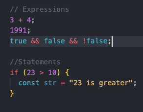

- expressions produce values, statements produce actions
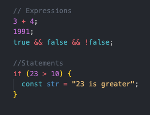

- only expressions, not statements, can be inserted into template literals
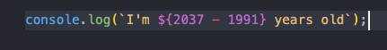

- first part is condition followed by question mark then result if condition is met
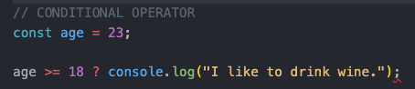

- followed by colon then else statment- if condition is not met
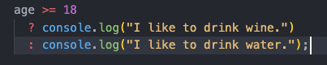

-  the ternary operator lets you make a comparison inside the variable, so instead of using an if else statement, it can be used as an expression, without predefining the variable first

- to set js to strict mode, use strict must be the first line of code in the file, only comments can come before because they'll be ignored, strict mode makes it easier to avoid accidental errors
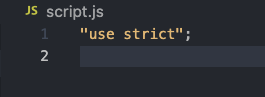

- the part between the curly braces in a function is called the function body
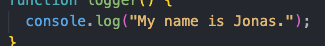

- the process of using a function is colled invoking, calling, or running the function
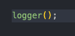

- in a js function, the parameter is the placeholder in parenthesis in the function definition, and the argument is the value assigned to it when the function is called
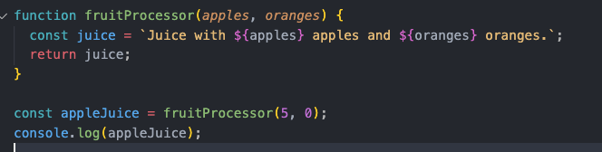

- an anonymous function can be stored in a variable and used like an expression, while a regular, named function is a declaration and cannot
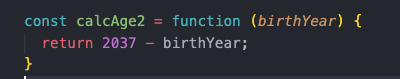

- function declarations can be called before they are defined in the code, but function expressions cannot
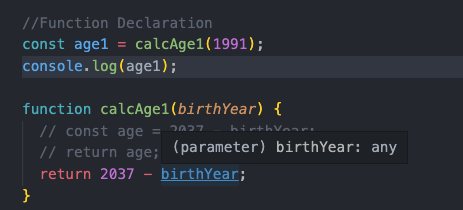

2023-03-31 22 pop removal method returns the element that was removed, not the length like push or unshift
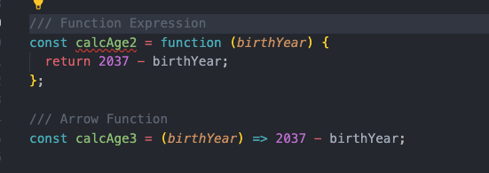

2023-03-31 23 shift removes first element of array
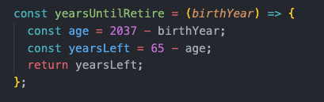

2023-03-31 24 calling the indexOf method on an element not included in an array returns neg 1
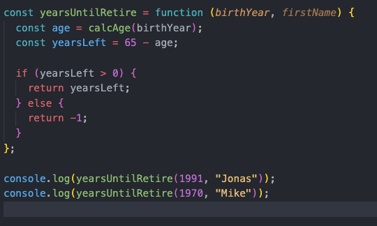

2023-03-31b 2 statement declaration is like a complete sentence, and expressions are like the words
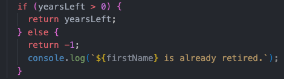

2023-03-31 14 an arrow function works like a function expression, but with even less code to write, can be stored in variable, with parameter in parenthesis and the return after the arrow, arrow functions also have no "this" keyword

2023-03-31 15 in a more complex, multi-line arrow function, that requires curly braces after the arrow, the word return must be added to return statement
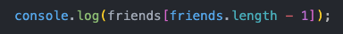

2023-03-31 16 it's common practice to return neg 1 or 9999 as the else option when a condition is not met when the inputs are numbers
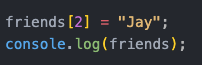

2023-03-31 17 code written after a return statement, like the console log here, will be ignored because the return statement exits the function
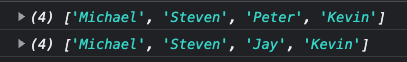

2023-03-31 18 define an array with either square brackets or the new keyword before the capitalized version of it as a function with contents in function parameters
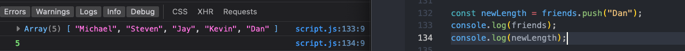

2023-03-31 19 pull the last element of an array by subtracting one from the length inside the square brackets for its index
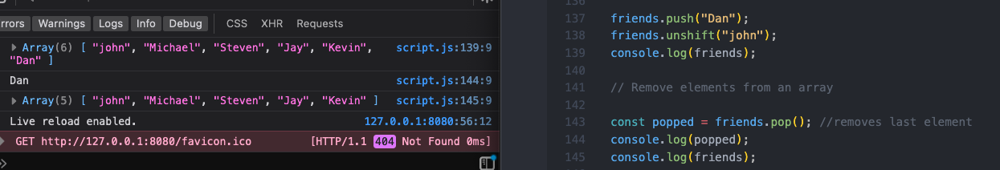

2023-03-31 20a can change contents of array treating each element like a variable with square bracket and index
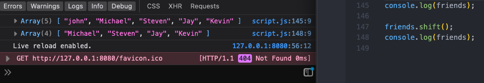

2023-03-31 20b can change contents of array treating each element like a variable with square bracket and index
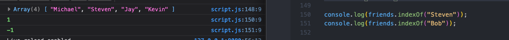

2023-03-31 21 push or unshift a new element to an array automatically returns the new length of that array

