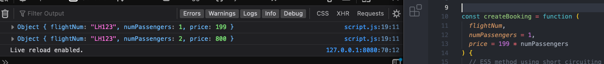
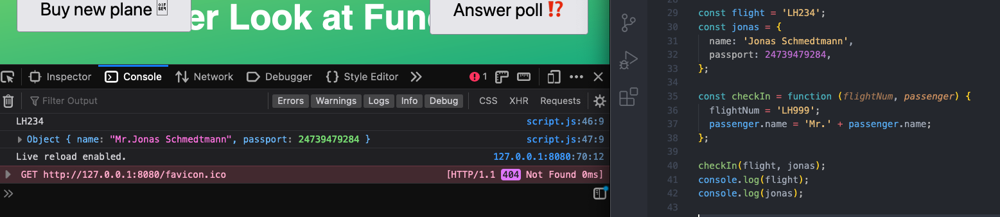
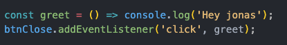
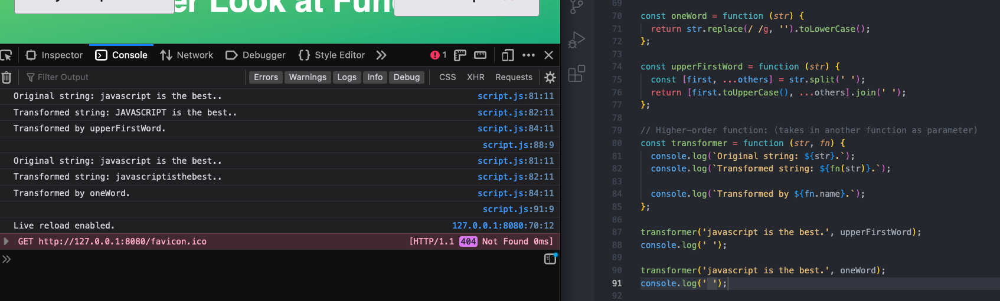
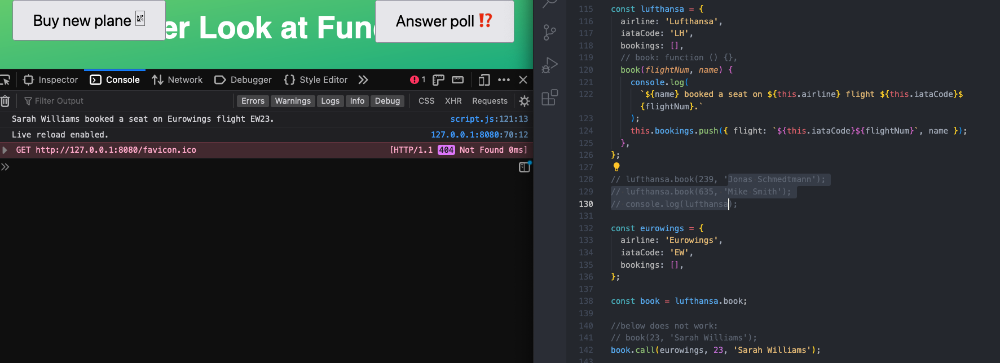

# JS-Notes

## FUNCTIONS

### 5/8/23

- Use defualt values of other parameters set before a parameter in its default (like a variable):

- when inputting arguments, you cannot skip a parameter to fill in next argument, as a workaround, set it as undefined, which in this case, just pulls the defualt value instead

- flight const is primitive value, which copies the value of flight into the var flightNum when the function is called, so that when flightNum is assigned inside the function, it's like a separate variable, ref value

- hovering flightNum variable shows that it was never used in the function

- js functions are first class functions which means they can be treated as values, can be passed to other functions, can be returned from functions, and have their own methods
- higher order functions are functions that receive another function as an argument or returns a new functions or both
- here, addEventListener is the higher-order function because it receives another function as an input, and greet is the callback function, called by addEventListener when the event happens

- functions also have their own properties, such as name, which connects to the name of the function

- a function returned inside a higher order function can then be stored in a new varibale when it is called

- when two separate arguments are passed to a higher-order function, the first argument is passed to the called function, and the second argument is passed to the return function it contains

- enhanced object literal sytax to write a method for an object without defining a function

- enhanced object literal sytax to write a method for an object without defining a function

- when nested function/method is pulled out of a higher-order function it is like a regular function, which does not have a "this" keyword, so when trying to call it, anything referring to the this keyword is undefined

- to use the internal method with a this keyword, you must explicitly define it, using either call, apply, or bind function methods

- in the call method, the first parameter is what the "this" key word should point to, followed by the other parameters the method requires, this technique allows you to use a method from inside a function with a different function

- apply method does not receive a list of arguments like call does but instead the this keyword reference and then an array

### 5/9/23
